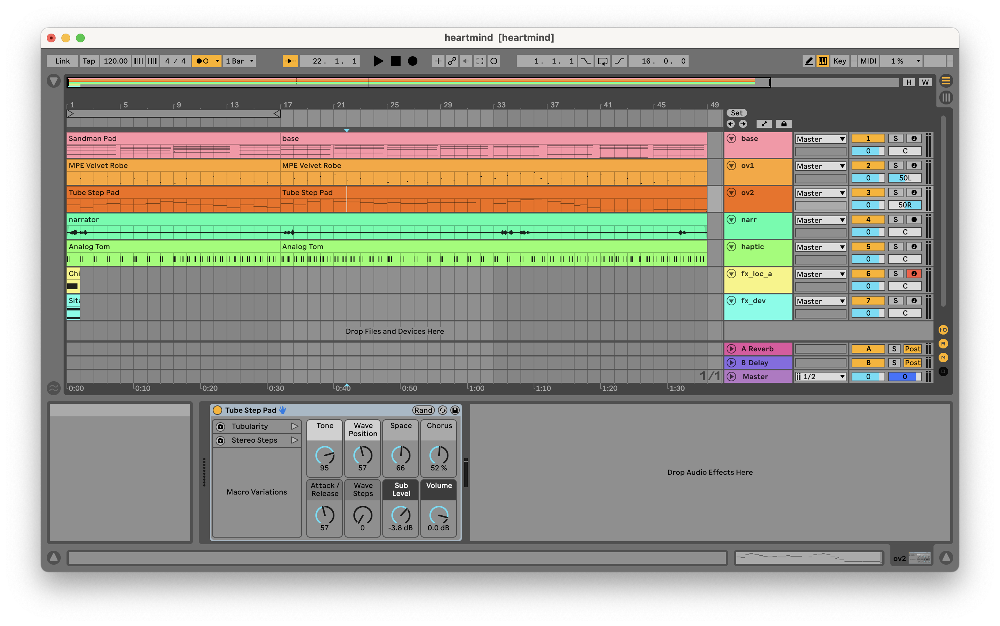
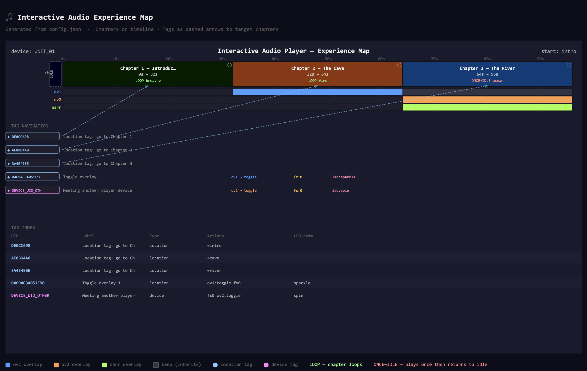

# Interactive Audio Player
### Teensy 4.1 · 7.1 Multichannel · NFC Navigation · LED Feedback · Haptic Output

An embedded audio player designed for immersive, location-based experiences. Audio
content lives in a single multichannel WAV file on an SD card. NFC tags at physical
locations trigger chapter jumps, overlay fades, and sound effects. A WS2812 LED ring
provides visual feedback. A haptic transducer delivers tactile output from the LFE channel.

---

## Hardware

| Component | Part | Notes |
|---|---|---|
| MCU | Teensy 4.1 | 600MHz Cortex-M7, 1MB RAM |
| Audio codec | Teensy Audio Shield (SGTL5000) | Stacked on Teensy |
| NFC reader | M5Stack WS1850S RFID Unit | I²C @ 0x28 |
| LED | M5Stack HEX RGB Unit (SK6812 × 37) | Single data wire |
| Haptic output | PWM pins 3+4 → RC filter → transducer amp | See wiring |
| SD card | SanDisk Ultra or Extreme (A1/A2 rated) | FAT32, built-in Teensy slot |

---

## Wiring

```
┌─────────────────────────────────────────────────────────┐
│                     Teensy 4.1                          │
│                                                         │
│  Audio Shield ─── stacked on pins 18-23, 6-9           │
│                   (no separate wiring needed)           │
│                                                         │
│  Pin 18 (SDA) ──── WS1850S SDA                         │
│  Pin 19 (SCL) ──── WS1850S SCL      NFC reader         │
│  Pin  9       ──── WS1850S RST      (I²C shared        │
│  3.3V         ──── WS1850S VCC       with codec,       │
│  GND          ──── WS1850S GND       no conflict)      │
│                                                         │
│  Pin  5       ──── SK6812 DIN        M5 Hex LED         │
│  5V           ──── SK6812 VCC        (external 5V       │
│  GND          ──── SK6812 GND         recommended)      │
│                                                         │
│  Pin  2 ──── 1kΩ ──┬──── transducer amp IN  Haptic PWM  │
│  Pin  4 ──── 270kΩ─┘                                    │
│               └──── 100nF to GND  (RC low-pass ~1.6kHz) │
└─────────────────────────────────────────────────────────┘
```

> **Note:** The Teensy 4.1 has no DAC. PWM output on pins 2 (MSB) + 4 (LSB)
> is combined by the resistor network. The RC filter recovers the audio signal.
> For a haptic transducer this quality is fully sufficient.
>
> **Required library patch:** The Teensy Audio Library hardwires `AudioOutputPWM`
> to pins 3+4 by default, but pin 3 does not reliably trigger its DMA on Teensy 4.1.
> Pin 2 works correctly. Patch the installed library once after PlatformIO installs it:
>
> ```bash
> sed -i 's/begin(3, 4)/begin(2, 4)/' \
>   ~/.platformio/packages/framework-arduinoteensy/libraries/Audio/output_pwm.cpp
> ```
>
> Verify:
> ```bash
> grep "begin(2" ~/.platformio/packages/framework-arduinoteensy/libraries/Audio/output_pwm.cpp
> ```
>
> This patch persists until PlatformIO updates the `framework-arduinoteensy` package.
> Re-apply after any framework update.

---

## SD Card

Format as **FAT32**. Use the **built-in Teensy 4.1 slot** (underside of board),
not the Audio Shield's slot — the built-in uses SDIO which is faster and avoids
SPI bus conflicts.

```
/ (SD card root)
├── config.json          ← experience definition (edit this)
├── experience.wav       ← 7.1 multichannel audio (from assemble_71.sh)
├── fx_dev.wav           ← RAM effect: device-to-device meeting
├── fx_loc_a.wav         ← RAM effect: location A
├── fx_loc_b.wav         ← RAM effect: location B
└── fx_boot.wav          ← RAM effect: startup (optional)
```

### macOS SD card prep

macOS silently writes hidden files (`.DS_Store`, `._filename`) to every FAT volume
which interfere with the Teensy's FAT library. Always clean after copying:

```bash
# Copy files
cp experience.wav /Volumes/SDCARD/
cp config.json    /Volumes/SDCARD/

# Clean hidden files
dot_clean /Volumes/SDCARD/
rm -rf /Volumes/SDCARD/.Spotlight-V100
rm -rf /Volumes/SDCARD/.fseventsd
rm -rf /Volumes/SDCARD/.Trashes
```

---

## Audio Production Workflow

### 1. Produce in Ableton


*Ableton arrangement view — base, narration, overlay 1, overlay 2, and haptic/LFE
exported as separate stems, all the same length and on the same tempo grid.*

Export four stems (all same length, same tempo grid):

| File | Format | Channels | Content |
|---|---|---|---|
| `base.wav` | 44100Hz 16-bit | **Stereo** | Main music bed |
| `narr.wav` | 44100Hz 16-bit | **Mono** | Narration / operator cues |
| `ov1.wav` | 44100Hz 16-bit | **Stereo** | Overlay stem 1 |
| `ov2.wav` | 44100Hz 16-bit | **Stereo** | Overlay stem 2 |
| `haptic.wav` | 44100Hz 16-bit | **Mono** | Low-freq haptic content (LFE) |

> **Ableton mono export:** File → Export Audio/Video → tick **Convert to Mono**

### 2. Assemble 7.1 WAV

```bash
chmod +x assemble_71.sh
./assemble_71.sh base.wav narr.wav ov1.wav ov2.wav haptic.wav experience.wav
```

Channel order in output (standard 7.1):

| Index | 7.1 Name | Content | Teensy output |
|---|---|---|---|
| 0 | FL | base L | stemMixer ch0 → i2sOut L |
| 1 | FR | base R | stemMixer ch0 → i2sOut R |
| 2 | FC | narration | stemMixer ch1 (gain controlled) |
| 3 | LFE | haptic | hapticMixer → PWM pin 3+4 |
| 4 | BL | overlay 1 L | stemMixer ch2 (gain controlled) |
| 5 | BR | overlay 1 R | stemMixer ch2 |
| 6 | SL | overlay 2 L | stemMixer ch3 (gain controlled) |
| 7 | SR | overlay 2 R | stemMixer ch3 |

### 3. Copy to SD card

```bash
cp experience.wav /Volumes/SDCARD/
dot_clean /Volumes/SDCARD/
```

---

## config.json Reference

The experience designer edits only this file — no reflashing needed.

```json
{
  "device_id":     "UNIT_01",
  "start_chapter": "intro",

  "idle": {
    "led": { "animation": "breathe", "color": "0x000066",
             "intensity": 0.35, "speed": 0.2 }
  },

  "chapters": [
    {
      "id":           "intro",
      "label":        "Chapter 1",
      "start_ms":     0,
      "loop_end_ms":  32000,
      "on_enter_fx":  -1,
      "loop":         true,
      "overlay_mode": "fresh",
      "overlays": { "ov1": false, "ov2": false, "narr": false },
      "led_background": { "animation": "breathe", "color": "0x003300",
                          "intensity": 0.55, "speed": 0.25 },
      "led_enter":    { "animation": "pulse_ring", "color": "0x00FF44",
                        "intensity": 0.8, "speed": 0.6, "duration_ms": 1200 }
    }
  ],

  "tags": [
    {
      "uid":   "04A32B1C",
      "label": "Forest entrance stone",
      "type":  "location",
      "actions": [
        { "do": "chapter",  "target": "intro" },
        { "do": "overlay",  "target": "ov1", "value": "toggle" },
        { "do": "fx",       "slot": 1 },
        { "do": "led",      "animation": "sparkle", "color": "0xFFFFAA",
          "intensity": 1.0, "speed": 0.9, "duration_ms": 1500 }
      ]
    }
  ]
}
```

### Chapter fields

| Field | Type | Description |
|---|---|---|
| `id` | string | Unique identifier, used in tag actions and `start_chapter` |
| `label` | string | Human-readable name, shown in serial debug only |
| `start_ms` | int | Start position in `experience.wav` (milliseconds) |
| `loop_end_ms` | int | End of loop region (milliseconds) |
| `on_enter_fx` | int | RAM FX slot to play on entry, -1 = none |
| `loop` | bool | `true` = loop forever, `false` = play once then return to idle |
| `overlay_mode` | string | `"fresh"` = apply overlay defaults on entry · `"keep"` = inherit current state |
| `overlays` | object | Default state for ov1, ov2, narr (only applied when `overlay_mode: "fresh"`) |
| `led_background` | object | Looping LED animation for this chapter |
| `led_enter` | object | One-shot LED animation played on chapter entry |

### Experience map


*Generated by `python3 tools/visualize.py` — horizontal timeline showing chapters,
overlay states, LED animations, and tag navigation arrows.*

### Tag fields

| Field | Type | Description |
|---|---|---|
| `uid` | string | NFC tag UID in uppercase hex (from serial monitor) |
| `label` | string | Human-readable description |
| `type` | string | `"location"` or `"device"` |
| `actions` | array | List of actions to execute when tag is tapped |

### Action types

| `"do"` | Parameters | Effect |
|---|---|---|
| `"chapter"` | `"target": "id"` | Seek to chapter with crossfade |
| `"overlay"` | `"target": "ov1/ov2/narr"`, `"value": "on/off/toggle"` | Fade overlay in or out |
| `"fx"` | `"slot": 0-7` | Play RAM effect (loaded from `fx_*.wav` at boot) |
| `"led"` | `"animation"`, `"color"`, `"intensity"`, `"speed"`, `"duration_ms"` | One-shot LED event |

### LED animations

| Name | Uses color hint | Description |
|---|---|---|
| `breathe` | ✓ | Smooth sine pulse between 25% and 100% of intensity |
| `solid` | ✓ | Flat constant colour |
| `sparkle` | ✓ (tint) | Dim base with random bright sparks |
| `fire` | ✗ | Heat simulation, own red/orange/yellow palette |
| `ocean` | ✗ | Ring-based wave, own blue/cyan palette |
| `rainbow` | ✗ | Rotating hue wheel |
| `pulse_ring` | ✓ | Ring expanding from centre outward |
| `spin` | ✓ | Arc rotating around outer ring |
| `flash` | ✓ | Three quick flashes then dim hold |
| `confetti` | ✓ (tint) | Random colour burst sparkles |
| `comet` | ✓ | Bright dot racing with fade trail |
| `off` | — | All dark |

**Parameters:** `color` = `"0xRRGGBB"` · `intensity` = 0.0–1.0 · `speed` = 0.0–1.0 · `duration_ms` = milliseconds (foreground only)

---

## Discovering Tag UIDs

1. Open serial monitor at **115200 baud**
2. Tap a tag on the WS1850S reader
3. Serial prints: `[NFC] Unknown: 04A32B1C — add to config.json`
4. Copy that UID into `config.json` → tags → uid
5. Copy updated `config.json` to SD card — no reflash needed

---

## Serial Debug Commands

| Command | Effect |
|---|---|
| `chapters` | List all chapters with time ranges and loop mode |
| `tags` | List all configured tags |
| `go <id>` | Jump to chapter by id (e.g. `go cave`) |
| `seek <ms>` | Seek to raw time position |
| `ov1` | Toggle overlay 1 |
| `ov2` | Toggle overlay 2 |
| `narr` | Toggle narration channel |
| `fx <n>` | Play RAM FX slot n |

---

## Visualizer

```bash
# Generate experience map HTML from config.json
python3 tools/visualize.py

# Custom paths
python3 tools/visualize.py my_config.json map.html
```

Opens `experience_map.html` in your browser — shows a horizontal timeline with
chapter blocks, overlay states, LED animations, and tag navigation arrows.

---

## Build & Flash

```bash
# Build
pio run

# Upload
pio run --target upload

# Serial monitor
pio device monitor --baud 115200

# Clean build
pio run --target clean && pio run
```

### platformio.ini dependencies

```ini
lib_deps =
    https://github.com/arozcan/MFRC522-I2C-Library.git
    bblanchon/ArduinoJson @ ^7.0.0
    fastled/FastLED @ ^3.6.0
```

---

## Project Structure

```
src/
  main.cpp               ← Setup, loop, NFC poll, state machine
  AudioPlaySdWavMulti.h  ← Custom 7.1 WAV player with deferred seek
  ConfigLoader.h         ← Parses config.json into typed structs
  LedAnimator.h          ← Non-blocking SK6812 animations
  RamPlayer.h            ← Loads short WAVs into RAM at boot

tools/
  visualize.py           ← config.json → HTML timeline view
  assemble_71.sh         ← Assembles stems into 7.1 WAV via ffmpeg
```